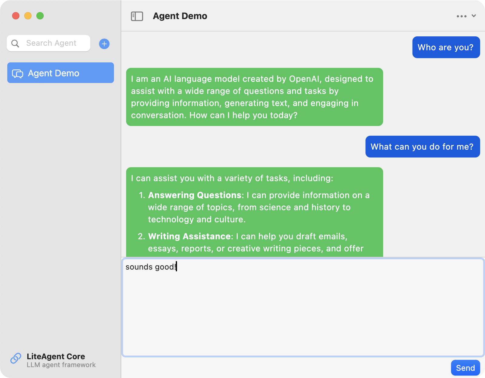
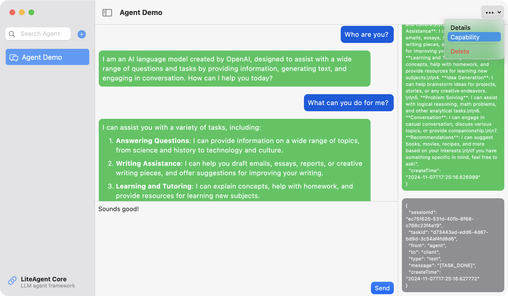
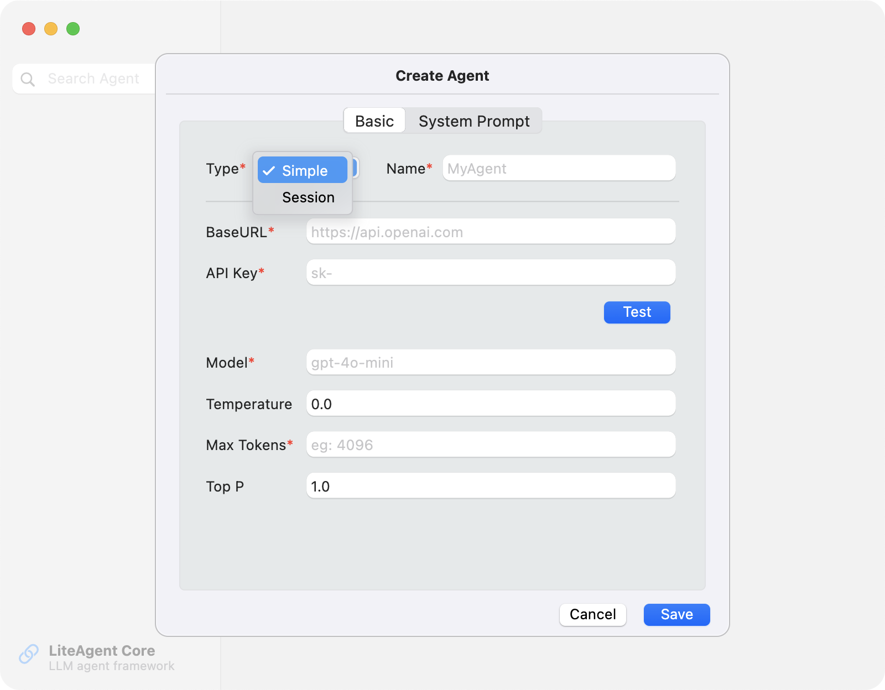

# Ajant

A Flutter desktop LLM Agent UI for [LiteAgent Core](https://github.com/LiteVar/lite_agent_core_dart)

## Features

- A brief UI for [LiteAgent Core](https://github.com/LiteVar/lite_agent_core_dart)
- OpenAI Style API Client base on [dart_openai](https://github.com/anasfik/openai)

## TODO
| Planning                          | DONE |
|-----------------------------------|------|
| **macOS** Base Chat with Settings | ✅    |
| Simple & Session Agent Support    | ✅    |
| **Windows** UI Support            | TODO | 
| Session with Tools                | TODO |
| MultiAgent Support                | TODO |

## Screenshots

- Chat: User chat to agent

- Detail: 

- Create Agent:

## Installation

- Download the file `Ajant.app` for macOS in Release
- Move the file `Ajant.app` to `/Applications` folder
- Click the `Ajant` Icon in `Launchpad`

## Usage

1. Click "+" button then Create Agent
2. Set Type, Name and LLM configs: 
    - `Simple` type: one request and one response from LLM, without context
    - `Session` type: keep context until not any message after timeout
    - Can be modified by `...`>`Capability`
3. Start your chat to Agent